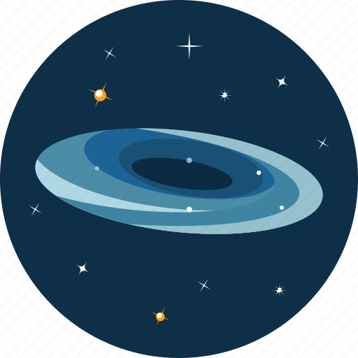

<h1 align="center">
    <p>SpaceX</p>
    
    <p>Faça uma Viagem Espacial e as Administre.<p>
</h1>

<h1 align="center">Site do Projeto
<a href="https://spacex-gabriel.surge.sh/">
Aqui</a></h1>


## 📕 Sobre o Projeto

**SpaceX**  Um projeto voltado totalmente aos estudos do curso que estou fazendo na ( Labenu ) de full Stack. O projeto consiste em fazer e administrar viagens espacias. Onde você pode criar suas proprias viagens na área administrativa. Para que as pessoas ou até mesmo você possa fazer uma solicitação á aquela viagem. E depois aprova e reprova ela na área de Admin. Me desculpe pelo o erro na palavra ( voltar ) que foi escrita com ( U ).


## 🔨 Tecnológias usadas

- [React](https://pt-br.reactjs.org/)
- [JavaScript](https://www.javascript.com/)
- [Style-Components](https://styled-components.com/)
- [Axios](https://axios-http.com/)
- [React-Router-Dom](https://reactrouterdotcom.fly.dev/docs/en/v6/getting-started/overview)

## ♻ Como contribuir ou rodar o projeto na sua maquina

### passo a passo

```bash
# Clone the project
$ git clone  https://github.com/GabrielSS187/SpaceX.git
```

```bash
# Enter directory
$ cd  SpaceX
```

```bash
# Install the dependencies, if use npm
$ npm Install
```

```bash
# Install the dependencies, if use yarn
$ yarn
```

# Autor

Gabriel Silva Souza

https://www.linkedin.com/in/gabriel-silva-souza-developer
